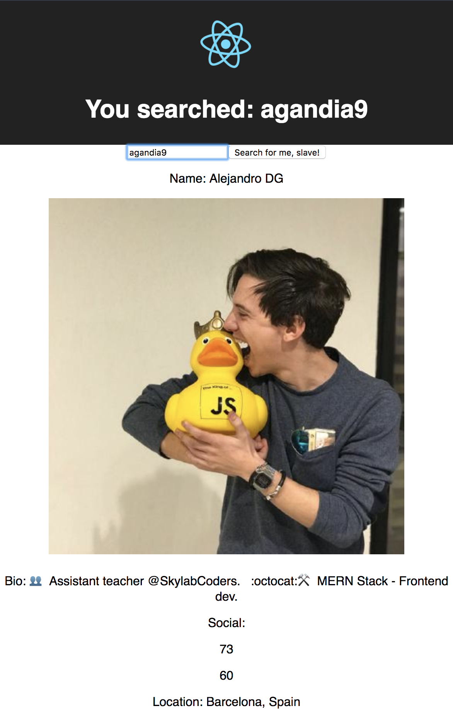

## LearnYouReact

When the fetch call ends, we should see in console the info of user... update the state with the received info and pass it as a prop in `MainContent`.

In `MainContent` we should print the info

