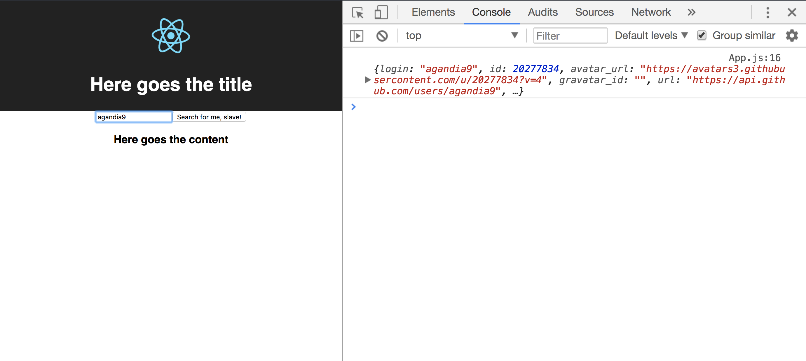

## LearnYouReact

Create two handlers function in App,
the first called `_handlerSearchUser` and pass it as a property to SearchForm, this function should do a `fetch` function to github api *https://api.github.com/users + username*.
The second, named `_handlerWriteName` should update the state when *change* the input.

