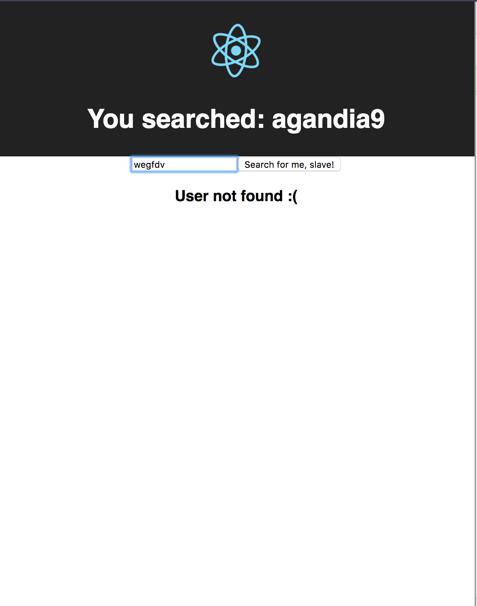

## LearnYouReact

Errors! If the fetch api fails, we should update a property in state called `onError`, initialy in *false*, to *true*, search about
[ `conditional rendering` ](https://reactjs.org/docs/conditional-rendering.html) to see how we can show to user a info if the user not exist in github.

